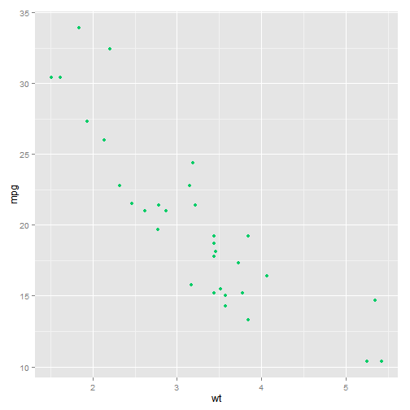
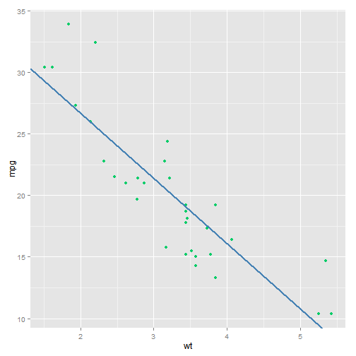

## Project Purpose

The purpose of my Shiny App is to illustrate the process by which a Linear Regression line is calculated.

- The app can be found here at [ShinyApps.io](https://atidmore.shinyapps.io/9DDP)  
- The source code can be found on [GitHub](https://github.com/ATidmore/DataProducts_Project/tree/master)

--- .class #id 

## The Data
Using the built-in "mtcars" dataset in R, I modeled a simple relationship between the car's weight ("wt") and its fuel efficiency ("mpg"). We can see that the data points are negatively correlated.

 

---

## The Application

The application will allow a user to learn how a Linear Regression line is created by optimizing the position of the line his/herself. A message displays to the user if he/she optimized the line - according to the Least Squares method (excerpt below).
 

---
## Conclusion

I hope you enjoyed using my ShinyApp to find the optimal Linear Regression line! 

Best of luck to you as you continue on the Coursera Data Science Certification. 
